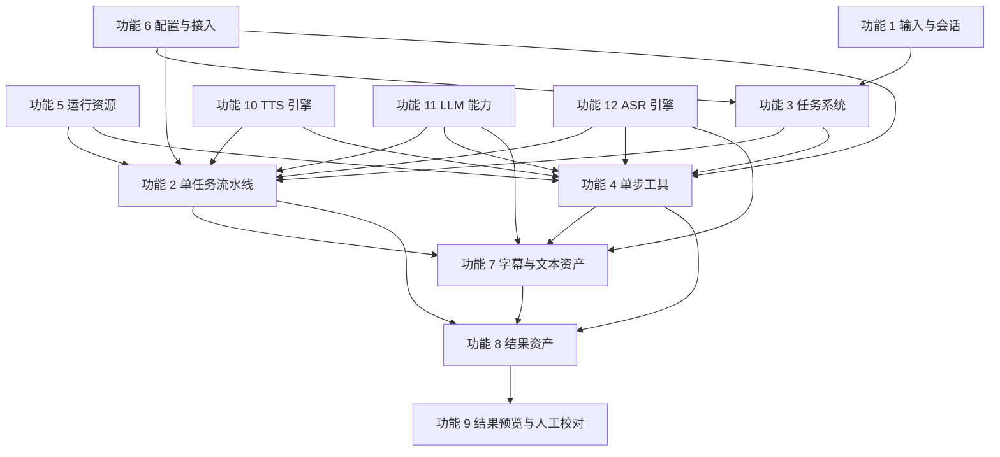

# [已归档] AsmrHelper 功能架构总览 V1

## 目标

- 将当前已经确认的 `1-12` 个功能域收口成一张统一架构地图。
- 明确哪些功能是稳定主干，哪些功能是引擎能力域，哪些功能是结果消费层。
- 为后续从“功能确认”过渡到“API 收口 / 中间层重构 / 具体实现”提供统一基线。

## 总体原则

### 1. 不让历史实现反向定义新架构

- 旧 GUI、旧页面、旧 route、旧平铺字段都不能继续主导功能边界。
- 可以保留现有实现经验，但不能继承其职责混杂方式。

### 2. 先区分稳定主干，再区分引擎扩展

系统中真正稳定的不是“某个页面”或“某个 provider”，而是：

- 输入与会话
- 任务系统
- 资产模型
- 结果索引
- 配置与运行条件

像 TTS / LLM / ASR 这种 provider 相关能力，应该作为独立能力域接入，而不是直接写死在 pipeline 或工具页里。

### 3. 参数定义、参数冻结、运行时注入必须分开

系统统一采用这三个对象：

- `CapabilityDescriptor`
  - 定义 provider 或引擎支持什么能力与参数
- `ExecutionProfile`
  - 冻结“这次任务实际怎么跑”
- `RuntimeBinding`
  - 在执行时注入密钥、模型路径、device、runtime client 等运行时资源

### 4. 所有后台任务进入统一任务系统

无论任务来自：

- 完整流水线
- 单步工具
- 字幕相关处理
- 后续更多后台能力

都应进入功能 3 的统一任务队列。

## 架构分层

当前 `1-12` 个功能域建议按 5 层理解。

### A. 基础控制层

负责系统“怎么配置”和“能不能运行”。

- 功能 5：模型与运行资源管理
- 功能 6：配置与提供方接入管理

这是所有业务层的底座。

### B. 输入与任务控制层

负责“要处理什么”和“怎么变成后台任务”。

- 功能 1：工作空间与输入管理
- 功能 3：统一任务生成与任务队列

这是所有执行流程的入口与调度中枢。

### C. 业务执行与资产层

负责真正的业务编排、工具执行和中间资产。

- 功能 2：单任务音频汉化流水线编排执行器
- 功能 4：单步工具执行体系
- 功能 7：字幕与文本资产管理
- 功能 8：结果资产与产物索引管理

这一层是业务主体，但它不直接拥有 provider 私有能力定义。

### D. 引擎能力域层

负责 provider / engine 级能力边界，而不是页面级功能。

- 功能 10：TTS 引擎管理与扩展能力管理
- 功能 11：LLM 能力管理与衍生操作管理
- 功能 12：ASR 引擎管理与扩展能力管理

这一层的核心价值是：

- 支持多个引擎
- 隔离引擎私有能力
- 防止 pipeline、工具页、页面表单直接绑定某个当前实现

### E. 结果消费层

负责用户如何查看、试听、确认结果。

- 功能 9：结果预览、浏览与人工校对

这一层只消费结果，不反向定义结果模型。

## 功能域分类

### 一类：稳定主干功能

这些功能不依赖某个具体引擎，属于长期稳定主干：

- 功能 1：工作空间与输入管理
- 功能 3：统一任务生成与任务队列
- 功能 5：模型与运行资源管理
- 功能 6：配置与提供方接入管理
- 功能 7：字幕与文本资产管理
- 功能 8：结果资产与产物索引管理
- 功能 9：结果预览、浏览与人工校对

### 二类：业务执行功能

这些功能属于业务执行壳层，本身依赖主干与引擎能力域：

- 功能 2：单任务音频汉化流水线编排执行器
- 功能 4：单步工具执行体系

### 三类：引擎能力域

这些功能本质上是 provider / engine 管理层，而不是页面功能：

- 功能 10：TTS 引擎管理与扩展能力管理
- 功能 11：LLM 能力管理与衍生操作管理
- 功能 12：ASR 引擎管理与扩展能力管理

## 功能关系图

## 关键依赖关系

### 功能 2 的真实定位

功能 2 不是原子能力，而是“单任务编排执行器”。

它组合消费：

- 功能 12 的 ASR 能力
- 功能 11 的 LLM 衍生操作
- 功能 10 的 TTS 能力
- 功能 7 的字幕资产能力
- 功能 8 的结果索引能力

### 功能 4 的真实定位

功能 4 不是工具业务本体，而是“工具执行器集合”。

它包装并分发：

- `tool.asr`
- `tool.tts`
- `tool.translate_subtitle`
- `tool.script_to_subtitle`
- 其他单步工具任务

但工具业务本体并不归功能 4 独占。

### 功能 7 的真实定位

功能 7 是字幕业务唯一归属层。

它吸收并统一：

- 字幕解析
- 字幕清洗
- 双语字幕组装
- 脚本转字幕
- 字幕导出

功能 3 可以托管字幕任务，功能 4 可以包装字幕工具入口，但字幕规则只属于功能 7。

## 当前已经明确不是一级独立功能的内容

### 1. 音色资产与音色生成

它们不是稳定一级功能域，而是：

- 功能 10 中某些 TTS 引擎的扩展能力

### 2. 翻译引擎

它不是独立引擎层，而是：

- 功能 11 中 LLM 衍生操作的一部分

### 3. 当前单一 ASR 实现

它不是产品边界，只是：

- 功能 12 中当前已接入的一个 ASR 引擎

### 4. 播放器或 Voice Lab 页面

它们不是能力域本身，只是功能消费或扩展入口，不应主导架构定义。

## 推荐实现顺序

如果从文档进入实现阶段，建议按这个顺序推进：

1. 先收口基础主干
   - 功能 1 / 3 / 5 / 6
2. 再收口资产层
   - 功能 7 / 8
3. 再重构执行壳层
   - 功能 2 / 4
4. 再整理引擎能力域
   - 功能 10 / 11 / 12
5. 最后补消费层
   - 功能 9

这样推进的好处是：

- 先把稳定契约定住
- 再让执行器和页面去依赖这些契约
- 避免一上来在页面或当前 provider 上做大改，导致再次被历史实现绑住

## 当前阶段不建议继续拆分的方向

现阶段已经有足够的功能域划分，不建议继续为下面这些内容再单独立一级域：

- 单独的“翻译引擎管理”
- 单独的“音色资产管理”
- 单独的“播放器功能域”
- 单独的“当前 ASR 模型管理”

这些内容已经分别被更稳定的能力域吸收：

- 翻译 -> 功能 11
- 音色扩展 -> 功能 10
- 播放与人工确认 -> 功能 9
- 当前 ASR 实现 -> 功能 12

## 一句话结论

AsmrHelper 的 V1 架构已经可以明确为：

> 以输入与任务系统为主干，以字幕与结果资产为中间层，以 TTS / LLM / ASR 作为独立引擎能力域，再由流水线、工具执行器和结果消费层共同构成完整产品结构。
