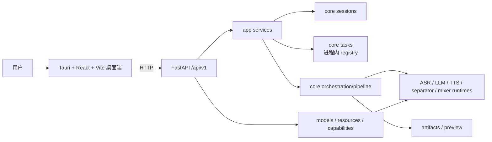

# AsmrHelper 架构与文档审计快照（2026-07-23）

> 本文是指定提交附近的历史审计快照，不再作为当前实现基线。当前状态以 [当前源码基线](../../roadmap/current-source-baseline.md) 和 [整体进度状态](overall-progress-status.md) 为准。

日期：2026-07-23  
适用分支：`refactor/re-design`  
代码基线：`f7c6b52` 加当前工作区的 P1 profile/阶段回写修改

## 1. 结论与事实源

项目现在不是从零重构，也不是继续删除旧目录的阶段。它已经有可启动的 FastAPI 后端、Tauri 桌面端、新的 pipeline 主执行器、任务/会话/产物 API 与引擎资源体系；当前处于 **Phase 2 后段的契约落码与主链路收束阶段**。

进度判断按下列优先级进行：

1. 当前源码、`git status` 与实际验证结果。
2. [当前源码基线](../../roadmap/current-source-baseline.md)。
3. 活跃的 V1 契约文档。
4. 旧 roadmap、设计草案和 `docs/archived/` 中的历史记录。

文档中的“目标/契约”不等于已经实现；“归档/历史”不等于当前待办。新增功能前必须先检查当前代码是否已具备对应能力。

## 2. 当前运行架构

当前入口与目标入口的差异：

| 范围 | 当前已实现 | 尚未收束到目标 |
| --- | --- | --- |
| 桌面 Workbench | 使用 `POST /pipeline-runs` 一次提交统一 StageProfile，后端立即返回 `202` 并后台接管 | 旧平铺 HTTP 参数已删除 |
| Pipeline | `src/core/orchestration/pipeline/` 已是主执行器，执行已移出 API 请求线程 | 低并发场景保留进程内线程；按产品约定，重启不恢复未完成执行 |
| 任务中心 | SQLite 保留终态任务与 Artifact 索引；桌面端按统一 TaskResult 读取主产物和预览能力，并通过 RuntimeEvent 展示实时诊断时间线 | 事件不跨重启持久化，历史事实仍以 TaskStatus 与 Artifact 为准 |
| 字幕 | 新实现位于 `src/core/subtitles/`，旧延迟导入问题已修复并有回归测试 | 字幕资产版本与主链路结果结构仍需统一 |
| 模型资源 | registry、异步安装和进度轮询已存在；状态已区分安装与可执行性并列出缺失条件；安装增量消息已统一为 `model_operation` RuntimeEvent | 安装链路仍依赖各模型下载器可提供的进度粒度 |

已删除的 `src/gui/`、`src/core/pipeline/` 与旧字幕路径不是迁移目标，任何活跃文档都不得把它们当作仍需保留的主路径。

## 3. 已验证的启动与构建状态

2026-07-23 在本机完成以下验证：

| 范围 | 命令或结果 | 结论 |
| --- | --- | --- |
| Python 语法 | `.venv\Scripts\python.exe -m compileall -q src` | 通过 |
| Python 测试 | `.venv\Scripts\python.exe -m pytest -q` | `166 passed` |
| HTTP 启动 | `scripts/verify_env.py` 创建 FastAPI app，发现 88 条路由；`/health` 返回 `ok` | 通过 |
| 前端 | `npm ci`、`npm run build` | 通过 |
| 桌面打包 | `npm run tauri -- build` | 通过，生成 `desktop/src-tauri/target/release/asmr-helper.exe` |
| 桌面启动 | 运行已生成应用并连接本地后端 | 已验证 |

这只说明 API、桌面壳和基础测试可运行，不表示每一种本地音频处理都已具备。Demucs、faster-whisper 等本地处理依赖属于 `audio` 可选组；当前环境已验证 Base ASR 最小链路，但未安装模型权重、未配置提供方 API Key 或未安装该可选组时，对应能力仍不可用。

## 4. 当前环境与交付边界

| 层级 | 当前约束 | 推荐入口 |
| --- | --- | --- |
| Python 基础环境 | Python 3.11 或 3.12，安装脚本默认 3.12 | `powershell -ExecutionPolicy Bypass -File .\setup.ps1` |
| 基础 API / 桌面联调 | 不强制安装本地 ASR/分离依赖 | `GUIRun.bat` 或 `run.bat api` |
| 本地完整音频处理 | 需要 `audio` 可选组和相应模型权重；CUDA 只影响性能 | `setup.ps1 -Models`；需要更多模型时用 `-Full` |
| Qwen 扩展 | Qwen TTS 与 Qwen ASR 的 Transformers 版本存在互斥约束 | 选择一个运行环境/安装档，不可把“全 extras”视为通用安装方案 |
| 桌面构建 | Node.js、npm、Rust/Cargo 均为前置 | `desktop` 中执行 `npm run build` 或 `npm run tauri -- build` |

`GUIRun.bat` 负责开发期的后端检查与 Tauri 启动；`run.bat` 仅提供 `desktop`、`api`、`test` 三种兼容入口。不要再使用未指定项目 `.venv` 的 `uv run ...` 作为日常验证或模型安装文档命令。

## 5. 已知问题与重构优先级

已完成 P0（2026-07-23）：`script_subtitle_service.py` 已迁至 `src.core.subtitles.script_to_subtitle`，补充真实 runtime 导入路径回归测试。

已完成 P1（2026-07-23）：PipelineService 生成 `mainline.v1` profile，planner 同时兼容新旧 profile；TaskStatus/API 已落地显式 stage、时间线、结构化 error 与 artifact_set_id，pipeline executor 回写标准阶段。全量测试 `126 passed`。

已完成主链路接管切片（2026-07-23）：Workbench 改为单次 `POST /pipeline-runs`；后端返回 `202` 后在后台执行；取消为协作请求；Pipeline 重试创建新任务；前端展示后端真实阶段和错误消息。全量测试 `133 passed`，桌面端构建通过。

已完成历史任务持久化（2026-07-23）：终态 TaskSpec、TaskStatus 和 Artifact 索引保存到 SQLite；重启时删除未完成任务及其索引；桌面端重新载入历史，历史任务只读并要求从 Workbench 重新提交。全量测试 `139 passed`。

已完成 StageProfile 收敛（2026-07-23，2026-07-24 清理兼容）：Workbench 和 `/pipeline-runs` 使用嵌套 v1 请求；旧平铺 HTTP 请求及联合解析已删除。

已完成 Provider 设置收敛（2026-07-23）：设置 API 与桌面端统一使用 Provider v1 包络；凭据读取改为布尔状态，空白写入不覆盖已有密钥；DeepSeek/OpenAI 测试执行真实轻量请求并返回稳定错误代码。全量测试 `148 passed`。

已完成结果语义收敛（2026-07-24）：Task、Pipeline、Tool 结果共享统一 TaskResult；主产物使用 `primary_artifact_id`，Artifact 使用 `type/primary/preview`；TaskCenter 不再读取 `files/primary_output` 或按扩展名猜测。全量测试 `151 passed`。

已完成 CapabilityOption、模型状态、RuntimeEvent、翻译核心、执行结果与工具接口收敛（2026-07-24）：任务生命周期和模型操作使用统一事件流；翻译实现已归入 LLM 域；所有任务化执行路径使用 TaskResult；旧 Pipeline 与 Tool 同步路由已删除。全量测试 `166 passed`。

| 优先级 | 问题 | 影响 | 建议完成标志 |
| --- | --- | --- | --- |
| P3 | 内部结果模型仍有路径字段 | PipelineResult/ArtifactSet 内部仍含 `primary_output/files` | 内部执行器逐步切换 ArtifactRecord |
| P3 | Tauri 开发期文件监视曾受 Cargo 产物影响 | Windows 上开发启动可能报 `EBUSY` | 保持 Vite 忽略 `src-tauri/target`，并在开发文档中保留该约束 |

## 6. DOCS 审计

| 分类 | 文档 | 当前判断与处理方式 |
| --- | --- | --- |
| 当前事实 | [当前源码基线](../../roadmap/current-source-baseline.md) | 当前源码、验证结果和最高优先级问题的第一事实源；随源码变化更新 |
| 当前总览 | 本文 | 架构、环境、验证、问题与文档定位的总入口 |
| 活跃目标 | [主链路](../../contracts/mainline-v1.md)、[数据结构](../../contracts/schemas-v1.md)、[Provider 与设置](../../contracts/provider-v1.md)、[兼容迁移](../../contracts/compatibility.md) | 四份 V1 文档是当前跨层契约；目标与实现差异集中记录在兼容迁移文档 |
| 活跃边界 | [领域边界总览](../../domains/README.md) | 只定义六组责任边界；ASR、TTS、LLM 作为 Provider 类别扩展，不再重复维护跨层契约 |
| 活跃设计 | `docs/designs/desktop-ui-redesign-blueprint.md` | 用于 UI 实现方向；实现前应对照源码基线确认进度 |
| 需持续收束 | [Phase 2 后段收尾计划](phase-2-legacy-core-replacement.md)、[总体进度状态](overall-progress-status.md)、[主链路检查清单](mainline-refactor-checklist.md) | 仍可用，但只作为执行清单；本轮已补充当前状态链接 |
| 历史快照 | [重构恢复简报（2026-07-18）](restart-briefing-2026-07-18.md) | 已归档；仅记录恢复时断点，其中旧接口与测试限制均不代表当前状态 |
| 需修订的设计 | `designs/model-asset-management-requirements.md` | 原“`uv sync --all-extras`”建议与当前互斥 optional extra 不再相容，已改为按安装档选择 |
| 归档资料 | [归档说明](../README.md) | 原 7 份契约和 12 份领域文档已归档；旧路径、旧命令和 `D:/WorkSpace/...` 链接不作为当前操作依据 |
| 仓库根部历史草案 | `refactor.md` | 保留为历史架构思考，不再是现状对照或执行入口 |

当前 DOCS 尚未充分体现的内容已在本文补齐：可启动/可打包的验证基线、Python 可选引擎边界、Qwen 依赖互斥、Windows 下 Tauri 开发约束、当前 API 与目标契约的差距，以及“能启动”不等于完整本地音频能力可用的发布边界。

## 7. 后续更新规则

每次改变主链路时按此顺序更新：

1. 修改代码和测试，执行相应验证。
2. 更新 [当前源码基线](../../roadmap/current-source-baseline.md) 的事实、验证结果和最高优先级缺口。
3. 若改变字段/API/边界，更新对应 V1 契约与 [领域边界总览](../../domains/README.md)。
4. 完成一个切片后，再更新 roadmap 状态；历史文档只追加“已被何处取代”，不反向改写历史。
