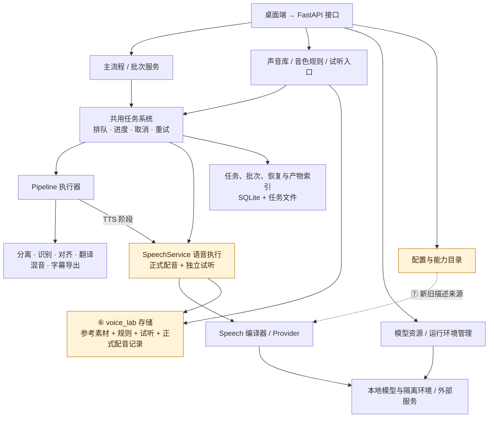
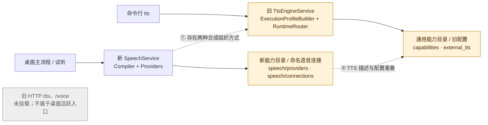

# 当前后端架构与待评估边界

核对日期：2026-09-29；代码基线：`0ba877b`。这是当前实现图，不是目标重构方案。省略 DTO、HTTP 参数校验和具体模型类，以保留主要调用与数据关系。

## 1. 当前主路径

实线表示主要调用、执行或读写方向；虚线表示待评估的重叠。橙色是已确认的边界交叉，不等于必须马上重构。

图中的声音入口和语音执行实际上仍主要由同一个 `SpeechService` 承担，拆成两个框是为了区分职责，并不表示它们已拆成独立服务。声音任务中的参考分析另调用音频处理/ASR 能力，未在图中展开。模型安装任务也复用任务调度；模型管理还向各执行模块提供模型与环境信息。

任务状态与产物索引是全项目共享基础设施。声音素材、规则、候选与连接目前集中于 `config/voice_lab`。LLM 等通用配置则由 SettingsService 管理；仅凭存储不同不能直接认定设计错误，问题是当前业务边界与数据归属不够明确。

## 2. TTS 的重复与迁移边界

两种组织方式最终可能共用部分底层引擎，不能等同于所有推理算法都写了两份。此次确认了命令行到旧服务的代码调用路径，未实际运行命令行合成；旧 VoiceService 文件还存在，但不能据此认定旧声音流程仍活跃。

## 3. 哪些部分值得讨论

| 标记 | 已确认的事实 | 疑问 / 尚未决定的内容 | 当前取舍 |
| --- | --- | --- | --- |
| ⑥ 正式任务和试听的数据归属 | 正式 TTS 创建实验/候选等记录，使用 voice_lab 存储；核心执行器反向获取应用层 SpeechService | 仅调整新产物目录是否足够？是否需要独立的合成执行接口？历史数据是否保持原地？ | 只登记，待讨论 |
| ⑦ 两套能力与配置描述 | 通用 capabilities/旧 external_tts 与 speech providers/命名语音连接并存 | 哪个作为唯一权威来源？旧描述改为兼容投影还是移除？ | 只登记，待讨论 |
| ⑦ 命令行旧入口 | src/cli.py 的 tts 命令调用 TtsEngineService，经旧 profile builder/runtime 合成 | CLI 是否继续支持？若保留，是否转接新 Speech 执行能力？ | 补充登记，未删除 |
| 共用任务调度和模型环境 | 主流程、试听、安装任务共用任务机制，推理依赖隔离环境 | 这是合理复用，不要求每个业务复制一套 | 保留 |
| 多种存储形式 | 任务状态使用 SQLite，声音资产使用文件/JSON | 不因技术形式不同就启动数据库迁移，应先明确归属与清理策略 | 不扩大范围 |

第 2 项执行器延迟注册、第 5 项本次 LLM 连接隔离已经修复。第 3 项混音附加记录失败、第 4 项全量声音数据查询仍存在，用户决定跳过；本图不把它们伪装成已解决，也不重新启动其修改。

## 4. 代码定位

- 路由挂载：`src/api/http/app.py`。
- 主流程：`src/app/services/pipeline_task_orchestrator.py`、`pipeline_service.py`、`batch_run_service.py`。
- 任务调度与恢复：`src/app/services/task_service.py`、`src/core/tasks/`、`src/app/persistence/`。
- 流程执行：`src/core/orchestration/pipeline/executor.py`。
- 新语音：`src/app/services/speech_service.py`、`src/core/speech/compiler.py`、`providers.py`、`local_worker.py`、`store.py`。
- 旧命令行路径：`src/cli.py` 的 `tts_cmd`、`src/app/services/tts_engine_service.py`。
- 能力与设置：`src/app/services/capability_descriptor_service.py`、`settings_service.py`、`src/provider_profiles.py`。
- 模型和环境：`src/app/services/model_service.py`、`resource_service.py`、`src/core/resources/`、`src/core/runtime/`。
