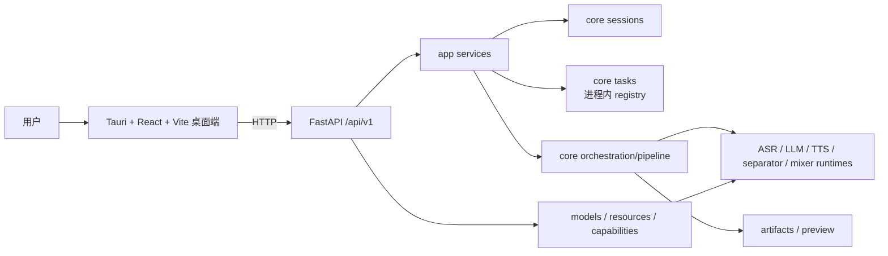

# AsmrHelper 当前架构与文档审计

日期：2026-07-23  
适用分支：`refactor/re-design`  
代码基线：`3bd5c4a` 加当前工作区的环境收束修改

## 1. 结论与事实源

项目现在不是从零重构，也不是继续删除旧目录的阶段。它已经有可启动的 FastAPI 后端、Tauri 桌面端、新的 pipeline 主执行器、任务/会话/产物 API 与引擎资源体系；当前处于 **Phase 2 后段的契约落码与主链路收束阶段**。

进度判断按下列优先级进行：

1. 当前源码、`git status` 与实际验证结果。
2. [当前源码基线](current-source-baseline.md)。
3. 本文和活跃的 V1 契约文档。
4. 旧 roadmap、设计草案和 `docs/archived/` 中的历史记录。

文档中的“目标/契约”不等于已经实现；“归档/历史”不等于当前待办。新增功能前必须先检查当前代码是否已具备对应能力。

## 2. 当前运行架构

当前入口与目标入口的差异：

| 范围 | 当前已实现 | 尚未收束到目标 |
| --- | --- | --- |
| 桌面 Workbench | 可选择输入、设置参数并运行任务 | 仍以兼容 `POST /pipeline/run` 为主；应迁至 `POST /sessions -> POST /tasks` |
| Pipeline | `src/core/orchestration/pipeline/` 已是主执行器，直接调用引擎 runtime | `PipelineService` 与 planner 仍主要消费旧式 `pipeline + stages + mix` 参数 |
| 任务中心 | 可查询、取消、重试、展示日志和产物入口 | `TaskStatus` 缺 `stage/error/timestamps/artifact_set_id`，前端仍会推断阶段 |
| 字幕 | 新实现位于 `src/core/subtitles/` | `script_subtitle_service.py` 仍延迟导入已删除的旧模块，调用时有 `ModuleNotFoundError` 风险 |
| 模型资源 | registry、安装状态、异步安装及进度轮询已存在 | 可选 Python 引擎、模型权重和系统工具的安装边界尚未完全产品化 |

已删除的 `src/gui/`、`src/core/pipeline/` 与旧字幕路径不是迁移目标，任何活跃文档都不得把它们当作仍需保留的主路径。

## 3. 已验证的启动与构建状态

2026-07-23 在本机完成以下验证：

| 范围 | 命令或结果 | 结论 |
| --- | --- | --- |
| Python 语法 | `.venv\Scripts\python.exe -m compileall -q src` | 通过 |
| Python 测试 | `.venv\Scripts\python.exe -m pytest -q` | `122 passed` |
| HTTP 启动 | `scripts/verify_env.py` 创建 FastAPI app，发现 91 条路由；`/health` 返回 `ok` | 通过 |
| 前端 | `npm ci`、`npm run build` | 通过 |
| 桌面打包 | `npm run tauri -- build` | 通过，生成 `desktop/src-tauri/target/release/asmr-helper.exe` |
| 桌面启动 | 运行已生成应用并连接本地后端 | 已验证 |

这只说明 API、桌面壳和基础测试可运行，不表示每一种本地音频处理都已具备。Demucs、faster-whisper 等重型本地处理依赖现在属于 `audio` 可选组；未安装模型权重、未配置提供方 API Key 或未安装该可选组时，对应能力仍不可用。

## 4. 当前环境与交付边界

| 层级 | 当前约束 | 推荐入口 |
| --- | --- | --- |
| Python 基础环境 | Python 3.11 或 3.12，项目 `.venv` | `powershell -ExecutionPolicy Bypass -File .\setup.ps1` |
| 基础 API / 桌面联调 | 不强制安装 CUDA PyTorch、Demucs、faster-whisper | `GUIRun.bat` 或 `run.bat api` |
| 本地完整音频处理 | 需要 `audio` 可选组和相应模型权重 | `setup.ps1 -Models`；需要更多模型时用 `-Full` |
| Qwen 扩展 | Qwen TTS 与 Qwen ASR 的 Transformers 版本存在互斥约束 | 选择一个运行环境/安装档，不可把“全 extras”视为通用安装方案 |
| 桌面构建 | Node.js、npm、Rust/Cargo 均为前置 | `desktop` 中执行 `npm run build` 或 `npm run tauri -- build` |

`GUIRun.bat` 负责开发期的后端检查与 Tauri 启动；`run.bat` 仅提供 `desktop`、`api`、`test` 三种兼容入口。不要再使用未指定项目 `.venv` 的 `uv run ...` 作为日常验证或模型安装文档命令。

## 5. 已知问题与重构优先级

已完成 P0（2026-07-23）：`script_subtitle_service.py` 已迁至 `src.core.subtitles.script_to_subtitle`，补充真实 runtime 导入路径回归测试；字幕相关测试 `38 passed`，全量测试 `122 passed`。

| 优先级 | 问题 | 影响 | 建议完成标志 |
| --- | --- | --- | --- |
| P1 | execution profile 仍是旧结构 | 新契约字段无法稳定贯穿 planner/executor | 同时支持新 `profile_version + stages + profiles` 和旧请求适配 |
| P1 | TaskStatus 字段不足 | 失败、阶段、时间线和产物关联无法成为后端事实 | 增加 stage、error、时间戳、artifact_set_id 并在 API 回写 |
| P2 | Workbench 仍走 `/pipeline/run` | session/task 主契约无法成为桌面默认路径 | 桌面改为先创建 session，再提交 task；旧路由仅作适配 |
| P2 | TaskRegistry 仅进程内 | 重启后任务与状态丢失，不能称为持久化队列 | 明确短期边界或设计持久化任务存储 |
| P2 | 模型依赖和权重安装分散 | “已下载”不总是“可执行” | 在 capability/resource 状态中明确 Python 依赖、权重、外部工具和可用性 |
| P3 | 兼容层仍较厚 | 新代码可能继续依赖 `ModelManager`、`core.translate` 和旧字段 | 新能力只依赖 registry/runtime 与 V1 DTO，兼容层逐步缩小 |
| P3 | Tauri 开发期文件监视曾受 Cargo 产物影响 | Windows 上开发启动可能报 `EBUSY` | 保持 Vite 忽略 `src-tauri/target`，并在开发文档中保留该约束 |

## 6. DOCS 审计

| 分类 | 文档 | 当前判断与处理方式 |
| --- | --- | --- |
| 当前事实 | [当前源码基线](current-source-baseline.md) | 当前源码、验证结果和最高优先级问题的第一事实源；随源码变化更新 |
| 当前总览 | 本文 | 架构、环境、验证、问题与文档定位的总入口 |
| 活跃目标 | `docs/contracts/` | 是 V1 目标契约，不应被误读为全部已落码；实现差距以本文第 2、5 节为准 |
| 活跃设计 | `docs/domains/`、`docs/designs/desktop-ui-redesign-blueprint.md` | 用于边界和实现方向；实现前应对照源码基线确认进度 |
| 需持续收束 | [Phase 2 后段收尾计划](phase-2-legacy-core-replacement.md)、[总体进度状态](overall-progress-status.md)、[主链路检查清单](mainline-refactor-checklist.md) | 仍可用，但只作为执行清单；本轮已补充当前状态链接 |
| 历史快照 | [重构恢复简报（2026-07-18）](restart-briefing-2026-07-18.md) | 记录恢复时的断点；其中旧测试限制已被 7 月 23 日验证结果取代 |
| 需修订的设计 | `designs/model-asset-management-requirements.md` | 原“`uv sync --all-extras`”建议与当前互斥 optional extra 不再相容，已改为按安装档选择 |
| 归档资料 | `docs/archived/` | 仅历史背景；其中旧路径、旧命令和 `D:/WorkSpace/...` 链接不作为当前操作依据 |
| 仓库根部历史草案 | `refactor.md` | 保留为历史架构思考，不再是现状对照或执行入口 |

当前 DOCS 尚未充分体现的内容已在本文补齐：可启动/可打包的验证基线、Python 可选引擎边界、Qwen 依赖互斥、Windows 下 Tauri 开发约束、当前 API 与目标契约的差距，以及“能启动”不等于完整本地音频能力可用的发布边界。

## 7. 后续更新规则

每次改变主链路时按此顺序更新：

1. 修改代码和测试，执行相应验证。
2. 更新 [当前源码基线](current-source-baseline.md) 的事实、验证结果和最高优先级缺口。
3. 若改变字段/API/边界，更新对应 V1 契约与 domain 文档。
4. 完成一个切片后，再更新 roadmap 状态；历史文档只追加“已被何处取代”，不反向改写历史。
